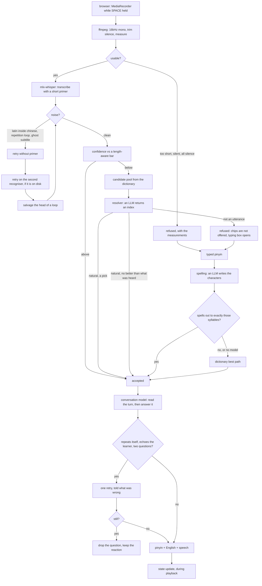

# Architecture

Two levels. The high-level design is the shape of the system and the rules it
obeys. The low-level design is where each rule lives in the code.

Read [DECISIONS.md](DECISIONS.md) alongside this. This file says what the system
is. That one says why, and what was tried before.

---

## 1. High-level design

### 1.1 The governing idea

> A turn-taking conversation system in which speech recognition is one noisy
> sensor. Code enforces turn-taking and truth boundaries. A language model
> understands and conducts the conversation. Nothing in code decides what a
> conversation means or where it should go.

### 1.2 Four distinct objects

Conflating any two of these is where the bad turns come from.

| object | status | lives in |
|---|---|---|
| the recording | fact | a wav in the work folder |
| what the recogniser thinks was said | **evidence, never truth** | `raw_asr` |
| what the learner meant | **truth**, and the only thing that crosses into the conversation | the accepted turn |
| what the other person says | generated from the accepted turn | the reply |

An utterance becomes an accepted turn in exactly three ways: the sounds were
credible on their own, the learner tapped a chip, or the learner typed it.
Everything else stays evidence.

### 1.3 Processes



### 1.4 The three invariants

Enforced in code. Everything else is the model's job.

**One reply per accepted turn.** Each user turn takes a monotonic number. A
reply that arrives for a superseded turn is discarded rather than rendered.

**Rejected recognition never enters history.** History carries accepted learner
turns and real partner turns. No raw transcriptions, no rejected candidates, no
resolver guesses that were turned down.

**Nothing downloads during a session.** Both recognisers are fetched by
`setup.sh`, which stops rather than warning if a fetch fails. Every model is
checked on disk before it is used, with a check that never touches the network.

### 1.5 What the model owns

What a scene means. What a waiter knows. Where a conversation should go. Whether
an answer was a yes. Which characters a string of syllables spells here. Whether
what was heard is a thing a person would say.

None of that is in code, and all of it was at some point.

### 1.6 What code checks, and why that is not ontology

Five checks survive, and each compares text against other text without making
any claim about meaning.

| check | claim |
|---|---|
| `is_noise` | Latin letters inside a Chinese turn; a repeated fragment; a known subtitle artefact |
| `repeats_itself` | a four-character run, or a question's subject words, reused from the same speaker's earlier turn |
| `echoes_learner` | the reply's opening clause substantially reuses the learner's own words |
| `questions_in` | how questions are marked in Chinese, which is grammar |
| `spells_out` | a string of characters reads back as exactly these syllables |

---

## 2. Low-level design

### 2.1 Layout

```
speaking-rig/
├── server.py           2,561 lines. FastAPI. Everything server side.
├── static/index.html   1,092 lines. One file: markup, style, script.
├── seeds.json          situations, one line each
├── levels.json         HSK bands: guidance and reply length
├── hotwords.json       words the recogniser is nudged towards
├── setup.sh            one-time install, fails loudly
├── start.sh            port 8765, kills only its own previous process
├── tests/
│   ├── regression.py   421 checks, no microphone, no model, no network
│   ├── bench_asr.py    recognisers over your own recordings
│   ├── bench_reply.py  language models over real conversation turns
│   ├── probe_audio.py  one recording, in detail
│   ├── label_session.py    a finished session, turn by turn
│   └── fixtures/       real failing recordings, with what was meant
├── DECISIONS.md        why each part is shaped this way
├── ARCHITECTURE.md     this file
└── SETUP.md            the long-form install guide
```

Single-file server and single-file page are deliberate. The whole thing is
readable in an afternoon and there is no build step.

### 2.2 HTTP surface

| method | path | purpose |
|---|---|---|
| `GET` | `/api/config` | levels, situations, models, recognisers with their on-disk state, health |
| `GET` | `/api/health` | every check, with a fatal flag per check |
| `GET` | `/api/ready` | files on disk only. Never touches the network |
| `POST` | `/api/warm` | dictionary, recogniser weights, model resident, voice started |
| `POST` | `/api/open` | the first thing the other person says |
| `POST` | `/api/listen` | audio in, an accepted turn or a refusal out |
| `POST` | `/api/rewrite` | typed pinyin or characters in, a turn out |
| `POST` | `/api/reply` | an accepted turn in, the other person's answer out |
| `POST` | `/api/clarify` | they did not catch it: re-ask the same question |
| `POST` | `/api/state` | update the record of what has been established |
| `POST` | `/api/gloss` | an English line for a turn, fetched separately |
| `GET` | `/api/audio/{name}` | a recording or a synthesised line |
| `POST` | `/api/selftest` | the whole pipeline on a fixed sentence, no microphone |
| `POST` | `/api/compare` | every model over the benchmark turns |
| `GET` | `/api/session` | the per-turn diagnostic log |
| `POST` | `/api/wipe` | delete every recording of your voice |

Two operational rules apply to all of them. Any unhandled exception becomes JSON
through middleware, so the browser never receives a stack trace it cannot parse.
And every numeric value is scrubbed before it is serialised, because Whisper
returns `-inf` for a degenerate segment and Python writes that into JSON as a
bare `NaN`, which is invalid and makes the browser reject the entire response
with an error that explains nothing.

### 2.3 Audio, `decode_audio`

ffmpeg to 16kHz mono with silence removed from both ends, using a
reverse-trim-reverse filter chain. Push-to-talk naturally produces a burst of
speech surrounded by silence, which is the exact shape that makes Whisper
hallucinate.

Then the file is measured: duration, RMS, peak, and the fraction of 20ms windows
above a rough speech floor. Those four numbers appear on screen whenever a turn
fails. Without them there is no way to tell a bad recording from a bad
recogniser.

Three refusals happen here, before any model runs: under 0.22s, RMS under 0.004,
or under 12% of the clip above the speech floor.

### 2.4 Recognition, `_listen`

Default `whisper-large-v2-mlx`. Not turbo: turbo has four decoder layers instead
of thirty-two and is the most repetition-prone variant on non-English audio.

Decoding uses a temperature ladder, `condition_on_previous_text=False`, and a
short primer of about twelve words chosen for relevance to the current topic. At
roughly twenty-eight primer words the decoder starts echoing the prompt back and
emitting English repetition loops.

Escalation on noise: retry without the primer, then on the second recogniser if
it is on disk, then salvage whatever came before the repetition. `我去公司ward
wardward…` is a real turn wearing a broken tail.

### 2.5 The acceptance bar, `free_pass`

The confidence score means different things at different lengths, because a
decoder that has lost the thread invents short things.

```python
0.62  if the transcription is 4 characters or fewer
0.46  if it is 5 or more
```

Measured against every turn of three real sessions: thirteen of fourteen land
where they should, and the fourteenth costs a resolver call rather than an error.

### 2.6 Candidates, `lattice` / `readings` / `candidate_pool`

A reverse index from bare pinyin to characters, built from the segmenter's word
list, with best-path segmentation over log probabilities. Syllable boundaries
are kept in the key, so `xi'an` and `xian` are different lookups. Erhua is
expanded before lookup, because `dianr` is written that way and the index is
keyed `dian|er`.

Alternative readings come from re-segmentation, homophones of the same key,
syllable swaps across the confusions learners actually make, sentence-final
particles, and a fuzzy match against the learner's own word list.

`candidate_pool(heard, k)` takes what was heard and a count. It has no parameter
for the conversation. That is the mechanism by which context ranks the list
rather than adding to it.

### 2.7 The resolver, `resolve`

```python
RESOLVE_SCHEMA = {
  "pick":    integer,   # index, or -1 if nothing beats option 0
  "natural": boolean,   # is option 0 a thing a person would say
  "certain": boolean,   # does the choice clearly fit the sounds and the question
}
```

Three fields, all integer or boolean. There is nowhere in its output a sentence
could go. Option 0 is what the recogniser heard and starts ahead. `-1` means
what was heard stands. `natural: false` is the only route to a dead end.

A resolver that cannot be reached, or that answers something unparseable, does
not eat the turn: what the recogniser heard stands, marked uncertain.

### 2.8 Typed pinyin, `read_typed` / `spell` / `spells_out`

`read_typed` parses word by word so one unreadable token cannot void the line,
and reports which tokens it skipped. Tone marks, tone numbers and bare pinyin
all parse.

Then a model writes the characters, given the conversation, and the answer is
read back into pinyin and compared to the syllables. Anything that does not
spell out to exactly those syllables is discarded and the dictionary answers
instead.

This is safe in a way the general case is not, because the syllables are not
evidence of anything. The learner typed them.

### 2.9 The conversation, `persona_prompt` / `_reply`

The brief is 167 words: who this person is, what has been established, the
level, and four rules.

```
Respond naturally to the latest thing they said. Do not repeat a question whose
answer is already evident from the conversation. Do not force the conversation
back onto an earlier thread. You may react, answer, comment, volunteer
information, ask something relevant, or naturally move the conversation forward.
```

```python
TURN_SCHEMA = {
  "reading": string,   # English, one line. Filled FIRST.
  "text":    string,   # simplified characters
  "english": string,
}
```

`reading` is first on purpose. A field written after the sentence is a caption
rather than a reading. It says what the learner meant and whether anything about
it is worth remarking on, and it appears on screen behind a link.

`reply_problems` then checks the result and one retry follows if anything is
wrong, carrying every problem at once. The retry only replaces the first attempt
if it has fewer problems. If both fail, the question is dropped and the reaction
kept, because a reply already known to be bad does not go out.

### 2.10 State, `state_update`

A short record of what is now true, at most four lines of English, revised each
turn. Facts only: going to the airport is going to the airport, not travelling
for work.

It runs while the reply is being spoken, so it costs no waiting. Each update
carries the turn it was computed from, because two can be in flight at once and
an older one landing last would undo the newer record.

### 2.11 The record, `record` / `/api/session`

One JSON line per turn in `session.jsonl`, with the layers kept apart:
recording, raw transcription, candidate pool, resolver verdict, accepted turn,
what the reply was given, its reading, what it produced, and every timing.

Without that separation a bug gets fixed in the wrong layer. The syllable-soup
chips looked like a chip problem and were a resolver problem. The driver changing
the subject looked like a persona problem and was one line in the clarification
prompt.

A diagnostic never breaks a turn: `record` swallows its own exceptions.

### 2.12 Client, `static/index.html`

No framework, no build step. `MediaRecorder` while the space bar or the button
is held, with `setPointerCapture` so drifting off the button does not stop the
recording. No `pointerleave` handler, which used to end recordings mid-sentence.

The microphone meter informs and never blocks a turn: a suspended `AudioContext`
once reported silence and swallowed every recording.

The page and the server carry the same build number and compare them. A stale
server running old code alongside a fresh page cost an entire evening of
diagnosing bugs that had already been fixed.

Only the newest turn is editable. Editing an older one discards everything after
it, which is correct and was confusing when any turn could be edited.

### 2.13 Testing

`tests/regression.py` fakes the recogniser, the language model and the on-disk
check, so it runs anywhere in a few seconds with no microphone and no network.
421 checks across 40 sections.

Every check exists because something broke once, and the comment on each says
what. Several sections are named after the session that produced them: *the
luggage turn and the gate question*, *a bit slower*, *nothing has said Beijing*,
*ordering chicken noodles*.

The suite also prints, on every run, four typed-pinyin cases the dictionary
still gets wrong. They are a known limit rather than a regression, and printing
them keeps them visible.

---

## 3. Known gaps

| gap | shape of the work |
|---|---|
| Whisper is English-first and weak on short learner Mandarin | swap to a Mandarin-first recogniser: SenseVoice or Paraformer via FunASR. A real piece of work, not a patch. Benchmark first with `tests/bench_asr.py` |
| the dictionary keeps one word per sound | needs a check for whether a character sequence is grammatical. Segmentation statistics and lattice round-trips were both tried and neither separates 我到了 from 我到楼 |
| reply depth depends on the model | measured rather than argued: **Compare your models** |
| tone feedback absent | pitch tracking against a reference contour. A separate project of comparable size |
| macOS only | a different recogniser and a different voice |
| one learner's failures | the fixtures are the specification, and they came from one accent |
